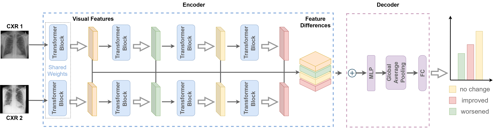

# Hierarchical Vision Transformers for CXR Disease Progression Detection


[`Amarachi B. Mbakwe`](https://sites.google.com/vt.edu/amarachiblessingmbakwe/),[`Lyuyang Wang`](https://www.linkedin.com/in/lyuyang-wang-605bb4254/), [`Mehdi Moradi`](https://www.eng.mcmaster.ca/faculty/mehdi-moradi/), and [`Ismini Lourentzou`](https://isminoula.github.io/)


Here, we provide the code implementation of the paper: Hierarchical Vision Transformers for CXR Disease Progression Detection.


## :triangular_ruler: Network Architecture



## :rocket: Requirements

```
Python 3.8.0
pytorch 1.10.1
torchvision 0.11.2
einops  0.3.2
```

## :wrench: Getting Started

To run the code, create a virtual ``conda`` environment named ``CheXRelFormer`` with the following cmd:

```
conda create --name CheXRelFormer --file requirements.txt
conda activate CheXRelFormer
```

## :open_book: Installation

Clone this repo:

```shell
git clone https://github.com/PLAN-Lab/CheXRelFormer.git
cd CheXRelFormer
```


## :open_book: Training

To train the models, edit the arguments in the ``run_CheXRelFormer.sh`` in the script folder. Then run the training script by running the command `sh scripts/run_CheXRelFormer.sh`.


## :open_book: Evaluation

To evaluate the models, edit the arguments in the ``eval_CheXRelFormer.sh`` in the script folder. Then run the training script by running the command `sh scripts/eval_CheXRelFormer.sh`.


## :open_file_folder: Dataset used in the paper

We used the following dataset:
- [Chest Imagenome](https://physionet.org/content/chest-imagenome/1.0.0/)
- [MIMIC-CXR-JPG](https://physionet.org/content/mimic-cxr-jpg/2.0.0/)


```
"""
The dataset folder was processed in the following structure；
├─A
├─B
├─label
└─list
"""
```

`A`: previous CXR from a patient;

`B`:post images CXR from the same patient;

`label`: comparison - improved, worsened, no change;

`list`: contains `train.txt, val.txt and test.txt`, each file contains the image names.

## :thumbsup: Citation
If you find this method and/or code useful, please consider citing
```
@inproceedings{10.1007/978-3-031-43904-9_66,
author="Mbakwe, Amarachi B. and Wang, Lyuyang and Moradi, Mehdi and Lourentzou, Ismini",
title="Hierarchical Vision Transformers for Disease Progression Detection in Chest X-Ray Images",
booktitle="Medical Image Computing and Computer Assisted Intervention -- MICCAI 2023",
year="2023",
publisher="Springer Nature Switzerland",
address="Cham",
pages="685--695"
}
```

